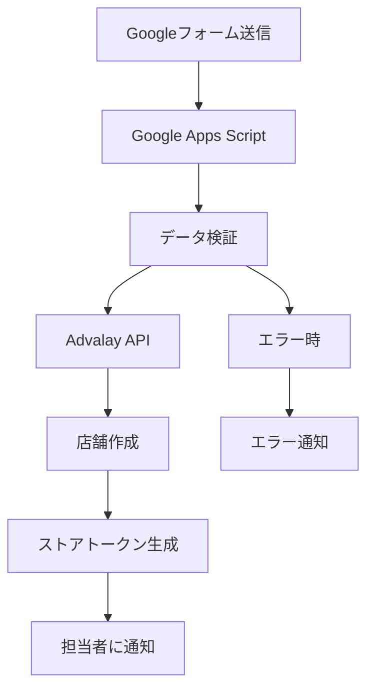

# Googleフォーム自動登録フロー セットアップガイド

## 📋 概要

このガイドでは、GoogleフォームからAdvalayシステムへの自動店舗登録フローの設定方法を説明します。

## 🛠️ セットアップ手順

### 1. Googleフォームの作成

1. **Googleフォームにアクセス**
   - https://forms.google.com にアクセス
   - 「空白のフォーム」を選択

2. **フォームタイトルと説明を設定**
   ```
   タイトル: Advalay店舗登録フォーム
   説明: 動画アップロードサービス「Advalay」への店舗登録を行います
   ```

3. **質問項目を追加**

   **必須項目:**
   - **企業名** (短答式テキスト)
   - **店舗名** (短答式テキスト)
   - **担当者名** (短答式テキスト)
   - **担当者メールアドレス** (短答式テキスト、メールアドレス形式)

   **オプション項目:**
   - **YouTubeチャンネル名** (短答式テキスト)

4. **フォーム設定**
   - 「設定」→「回答」→「新しい回答が送信されたときにメール通知を受け取る」をオン
   - 「回答」→「回答を1回だけ送信」をオン（推奨）

### 2. Google Apps Scriptの設定

1. **新しいプロジェクトを作成**
   - https://script.google.com にアクセス
   - 「新しいプロジェクト」をクリック

2. **スクリプトコードを設定**
   - `google-apps-script-sample.js` の内容をコピー＆ペースト

3. **設定値を更新**
   ```javascript
   const CONFIG = {
     // 本番環境の場合は適切なURLに変更
     API_BASE_URL: 'https://your-domain.com',
     
     // セキュリティトークン（強力なランダム文字列に変更）
     WEBHOOK_TOKEN: 'your-secure-webhook-token-here',
     
     // フォームID（GoogleフォームのURLから取得）
     FORM_ID: 'your-google-form-id-here',
     
     // フォームの回答シート名（通常は「フォームの回答 1」）
     RESPONSE_SHEET_NAME: 'フォームの回答 1'
   };
   ```

4. **フォームIDの取得**
   - GoogleフォームのURL: `https://docs.google.com/forms/d/FORM_ID/edit`
   - `FORM_ID` の部分をコピー

5. **セキュリティトークンの生成**
   ```javascript
   // 強力なランダムトークンを生成
   const token = Utilities.getUuid() + '-' + Utilities.getUuid();
   console.log('Generated token:', token);
   ```

### 3. Advalay API側の設定

1. **環境変数の設定**
   ```bash
   # .envファイルに追加
   WEBHOOK_SECRET_TOKEN=your-secure-webhook-token-here
   ```

2. **Webhookエンドポイントの保護**
   - セキュリティトークンによる認証を追加（必要に応じて）

### 4. トリガーの設定

1. **Google Apps Scriptでトリガーを設定**
   ```javascript
   // setup()関数を実行してトリガーを設定
   setup();
   ```

2. **手動テスト**
   ```javascript
   // testFormSubmission()関数でテスト実行
   testFormSubmission();
   ```

## 🧪 テスト手順

### 1. 手動テスト

1. **Google Apps Scriptでテスト実行**
   - `testFormSubmission()` 関数を実行
   - コンソールログで結果を確認

2. **フォーム送信テスト**
   - 実際のGoogleフォームに回答を送信
   - ログで自動処理を確認

### 2. エンドツーエンドテスト

1. **フォーム送信**
   ```
   企業名: テスト企業株式会社
   店舗名: テスト店舗
   担当者名: テスト太郎
   担当者メールアドレス: test@example.com
   YouTubeチャンネル名: テストチャンネル
   ```

2. **結果確認**
   - Advalay管理ダッシュボードで新しい店舗を確認
   - ストアトークンが正常に生成されているか確認

## 📊 フォームデータの流れ



## 🔧 トラブルシューティング

### よくある問題

1. **トリガーが動作しない**
   - Google Apps Scriptの権限設定を確認
   - トリガーが正しく設定されているか確認

2. **API送信エラー**
   - API_BASE_URLが正しいか確認
   - ネットワーク接続を確認
   - CORS設定を確認

3. **データが正しく送信されない**
   - フォームのヘッダー名が正しいか確認
   - 必須フィールドが入力されているか確認

### ログの確認方法

1. **Google Apps Scriptのログ**
   - Apps Scriptエディタ → 「実行」→ 「ログを表示」

2. **Advalay APIのログ**
   - サーバーログでWebhook受信を確認

## 🔒 セキュリティ考慮事項

1. **Webhookトークン**
   - 強力なランダム文字列を使用
   - 定期的にトークンを更新

2. **HTTPS通信**
   - 本番環境では必ずHTTPSを使用

3. **データ検証**
   - 入力データの検証とサニタイゼーション
   - 重複送信の防止

## 📝 運用上の注意点

1. **モニタリング**
   - フォーム送信の成功率を監視
   - エラー発生時のアラート設定

2. **バックアップ**
   - フォームデータの定期的なバックアップ
   - 設定値のバックアップ

3. **更新管理**
   - フォーム項目の変更時の対応
   - API仕様変更時の対応

## 🚀 本番環境への移行

1. **ドメイン設定**
   - 本番環境のAPI_BASE_URLに変更

2. **セキュリティ強化**
   - 本番用のセキュリティトークンを生成
   - IP制限の設定（必要に応じて）

3. **監視設定**
   - ログ監視の設定
   - アラート通知の設定
